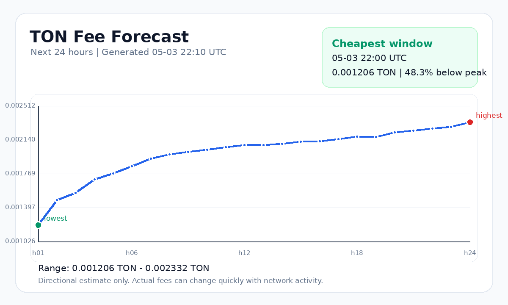

<div align="center">

# TON Transaction Fee Prediction

**An end-to-end ML pipeline that forecasts the next 24 hours of average TON blockchain transaction fees, served through a Telegram chatbot dashboard.**

[](https://www.python.org/)
[](LICENSE)
[](https://pages.cloudflare.com/)
[](https://t.me/ton_fee_forecast_bot)

<!-- TODO: docs/figures/forecast_next_24h.png 같은 대표 차트를 여기에 표시 -->
<!--  -->

Korean guide: [`docs/USER_GUIDE_KO.md`](docs/USER_GUIDE_KO.md)

</div>

---

## Overview

The project pulls raw transaction data from the **TON Center API v3**, aggregates it into an hourly feature table, trains a suite of forecasting models, and selects the best performer for a rolling 24-hour fee forecast. The forecast is exposed to users through a read-only Telegram bot.

- **Data**: TON mainnet transactions via TON Center API v3
- **Models compared**: linear regression (raw / `log1p`), ridge regression (raw / `log1p`, multiple alphas), gradient-boosted trees
- **Selection**: chronological holdout + expanding-window rolling backtest
- **Serving**: Telegram bot in webhook mode on Cloudflare Pages Functions

## Features

- Incremental data collection with resume/cache for long historical ranges
- Hourly feature engineering: lags, rolling statistics, network activity metrics
- Multi-model comparison with reproducible chronological evaluation
- Persisted best model artifact (`models/best_model.json`) consumed by the forecaster
- 24-hour forecast with diagnostic SVG/PNG visualizations
- Telegram bot with `/forecast`, `/besttime`, `/timezone` commands and per-request timezone override
- Two deployment modes: Cloudflare Pages webhook function **or** local Python polling for diagnostics
- GitHub Actions workflows for hourly refresh and daily retraining

## Tech Stack

| Layer | Tools |
|-------|-------|
| Data | TON Center API v3, pandas, NumPy |
| Modeling | scikit-learn-style ridge / linear / GBDT (vanilla Python, no sklearn dep) |
| Bot | Cloudflare Pages Function webhook; Python long polling for local diagnostics |
| Hosting | Cloudflare Pages, GitHub Actions |
| Charts | matplotlib-style SVG/PNG diagnostics |

## Quick Start

```bash
# 1. Clone & install
git clone https://github.com/ChrisLim369/ton_fee_prediction.git
cd ton_fee_prediction
python3 -m venv .venv
source .venv/bin/activate
pip install -r requirements.txt

# 2. Collect raw transactions (rate-limited without API key)
python3 scripts/collect_transactions.py \
  --days 30 --window-hours 1 --limit 100 \
  --max-pages-per-window 1 --workchain 0 \
  --sort asc --output raw_transactions.csv --verbose

# 3. Build hourly features, train models, forecast
python3 scripts/build_hourly_features.py --raw raw_transactions.csv --output hourly_features.csv
python3 src/train_model.py
python3 src/generate_forecast.py
```

> Set `TONCENTER_API_KEY` to lift the 1-request-per-second public rate limit.

## Project Structure

```
ton_fee_prediction/
├── scripts/                 # One-shot data + chart scripts
│   ├── collect_transactions.py
│   ├── build_hourly_features.py
│   └── generate_charts.py
├── src/                     # Pipeline modules
│   ├── update_data.py             # Incremental fetch
│   ├── build_features.py          # Feature engineering
│   ├── train_model.py             # Model comparison + selection
│   ├── generate_forecast.py       # 24h forecast from best model
│   ├── refresh_forecast_outputs.py # CI-safe full refresh
│   ├── telegram_bot.py            # Local polling bot
│   └── ton_pipeline.py            # Shared utilities
├── functions/
│   └── telegram-webhook.ts  # Cloudflare Pages webhook bot
├── .github/workflows/
│   ├── hourly_forecast_update.yml
│   └── daily_model_retrain.yml
├── models/                  # Trained artifacts + metrics
├── docs/                    # Guides, data dictionary, figures
├── hourly_features.csv      # Committed lightweight history
├── predictions.csv          # Next-24h forecast
└── wrangler.jsonc           # Cloudflare Pages config
```

## Architecture

```
TON Center API v3
       │
       ▼
collect_transactions.py ──► raw_transactions.csv  (gitignored, ~GB scale)
       │
       ▼
build_hourly_features.py ──► hourly_features.csv  (committed, ~MB)
       │
       ▼
train_model.py ──► models/best_model.json + comparison/backtest CSVs
       │
       ▼
generate_forecast.py ──► predictions.csv + docs/figures/*.png
       │
       ▼
Telegram bot (Cloudflare Pages webhook or local polling)
```

Webhook single source: `functions/telegram-webhook.ts` is the Cloudflare Pages Function for hosted Telegram webhooks; `src/telegram_bot.py` is local polling/diagnostics only.

## Configuration

| Variable | Purpose | Where to set |
|----------|---------|--------------|
| `TONCENTER_API_KEY` | Raises TON Center rate limit | Shell / GitHub Actions secrets |
| `TELEGRAM_BOT_TOKEN` | Bot auth | Local shell or Cloudflare Pages env |
| `TELEGRAM_WEBHOOK_SECRET` | Telegram webhook secret token | Cloudflare Pages env |

## Telegram Bot

Read-only dashboard exposing the latest forecast. Users see exactly what the saved CSVs contain — no retraining happens inside a Telegram request.

```text
/forecast              # Next-24h predicted fees + chart image
/besttime              # Cheapest forecast hour
/timezone              # Show / set display timezone
/forecast Asia/Seoul   # Per-call timezone override
```

### Run locally (polling)

```bash
export TELEGRAM_BOT_TOKEN="your_token_here"
python3 src/telegram_bot.py
```

### Deploy as a webhook (Cloudflare Pages)

Use Cloudflare Pages with framework set to `None`, no build command, and output directory `docs` as configured in `wrangler.jsonc`. GitHub Actions mirrors refreshed outputs into `docs/data/`; pushes to `main` trigger the Pages deployment.

Set encrypted Cloudflare Pages variables:

```text
TELEGRAM_BOT_TOKEN
TELEGRAM_WEBHOOK_SECRET
```

The webhook URL is:

```text
https://<project>.pages.dev/telegram-webhook
```

Register it with Telegram using `TELEGRAM_WEBHOOK_SECRET` as `secret_token`:

```bash
curl -sS -X POST "https://api.telegram.org/bot${TELEGRAM_BOT_TOKEN}/setWebhook" \
  -d "url=https://<project>.pages.dev/telegram-webhook" \
  -d "secret_token=${TELEGRAM_WEBHOOK_SECRET}"
```

`GET /telegram-webhook` returns health-check JSON.

Validate without starting polling:

```bash
python3 -m py_compile src/telegram_bot.py
python3 src/telegram_bot.py --validate
npm run check:worker
```

See [`docs/telegram_bot.md`](docs/telegram_bot.md) for the full operational guide.

## Automation

### Local cron

```cron
0 * * * * python /path/to/project/src/update_data.py
```

### GitHub Actions

- [`.github/workflows/hourly_forecast_update.yml`](.github/workflows/hourly_forecast_update.yml) — refresh recent data, features, predictions, charts
- [`.github/workflows/daily_model_retrain.yml`](.github/workflows/daily_model_retrain.yml) — refresh data, retrain model suite, regenerate forecasts

Both rely on `src/refresh_forecast_outputs.py`, which restores the gitignored `raw_transactions.csv` from Actions cache, updates incrementally, merges aggregates into the committed `hourly_features.csv`, and **never commits the raw CSV**.

Main pushes trigger Cloudflare Pages redeploys automatically. Heavy refresh, training, and chart generation stay in GitHub Actions.

See [`docs/automation.md`](docs/automation.md) and [`docs/automation_forecast_refresh.md`](docs/automation_forecast_refresh.md).

## Documentation

- [`docs/USER_GUIDE_KO.md`](docs/USER_GUIDE_KO.md) — Korean walkthrough
- [`docs/data_dictionary.md`](docs/data_dictionary.md) — column definitions for both CSVs
- [`docs/summary_report.md`](docs/summary_report.md) — coverage, missing values, limitations
- [`docs/model_evaluation_report.md`](docs/model_evaluation_report.md) — model performance summary
- [`docs/visualizations.md`](docs/visualizations.md) — generated SVG charts
- [`docs/telegram_bot.md`](docs/telegram_bot.md) — bot operational guide
- [`docs/automation_forecast_refresh.md`](docs/automation_forecast_refresh.md) — refresh + Cloudflare Pages deployment architecture

## Outputs

| File | Description |
|------|-------------|
| `raw_transactions.csv` | Transaction-level rows (gitignored, large) |
| `hourly_features.csv` | Hourly features + lags + rolling metrics + next-hour target |
| `predictions.csv` | Next 24h predicted average fees |
| `collection_metadata.json` | API request + sampling metadata |
| `last_updated.json` | Incremental update state, latest timestamp/logical time |
| `actual_vs_predicted.csv` | Test-period actuals vs predicted for the selected model |
| `models/best_model.json` | Selected best model |
| `models/model_metrics.json` | Chronological holdout metrics |
| `models/model_comparison.csv` | MAE / RMSE / R² / MAPE table |
| `models/rolling_backtest.csv` | Expanding-window backtest by model |
| `models/rolling_backtest_folds.csv` | Per-fold details + winners |
| `models/feature_importance.csv` | Coefficient-based feature importance |
| `docs/figures/forecast_next_24h.png` | Forecast image sent by the bot |

## Contributing

Issues and pull requests are welcome. For larger changes, please open an issue first to discuss intent.

## License

[MIT](LICENSE) © 2026 Changhyuk Lim
