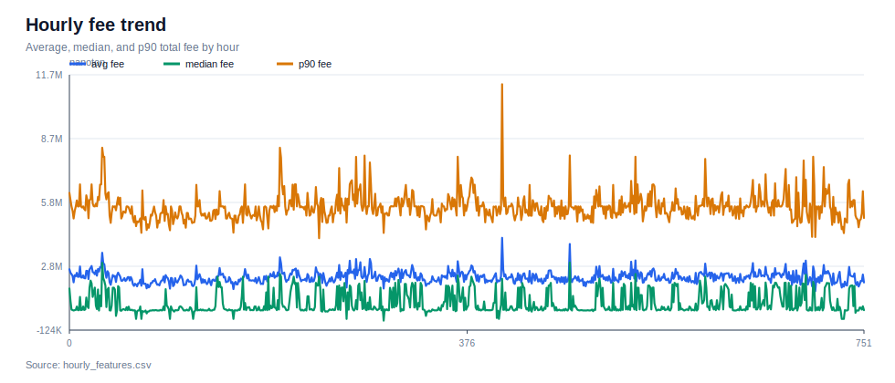
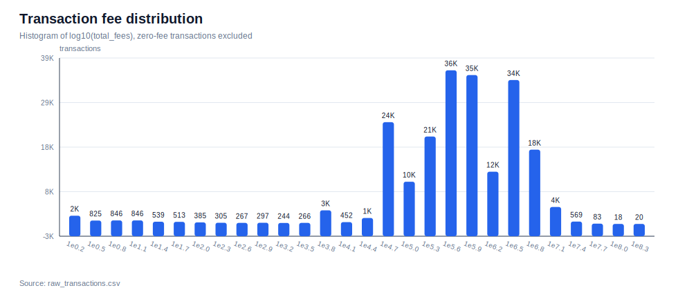
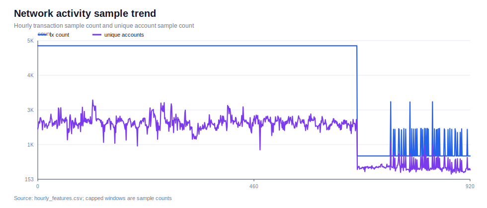
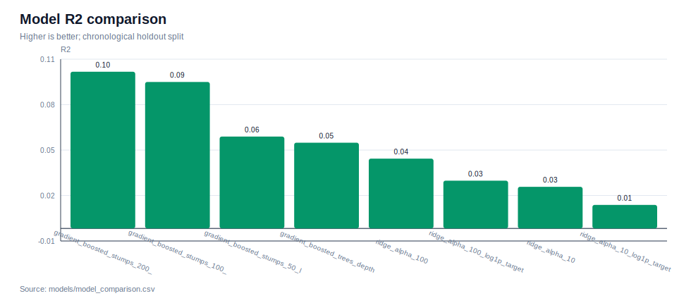
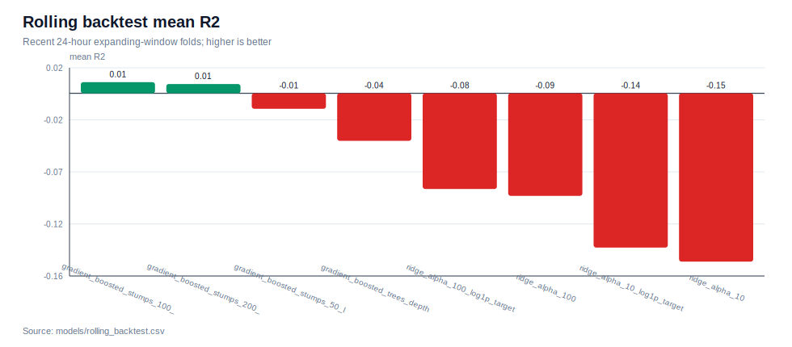
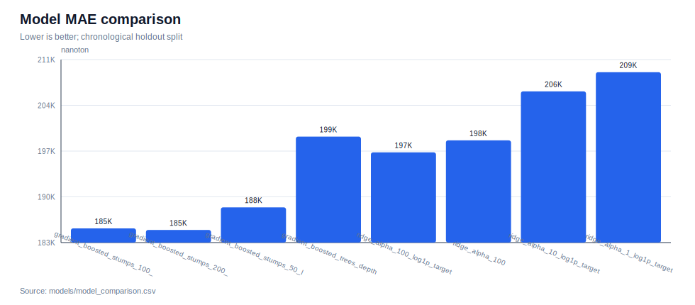
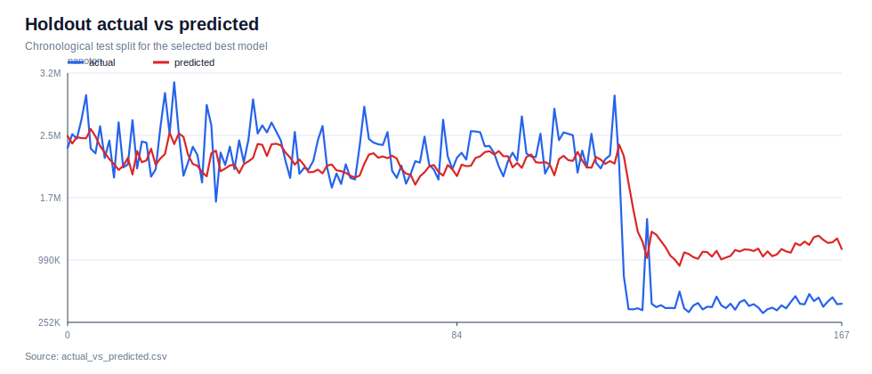
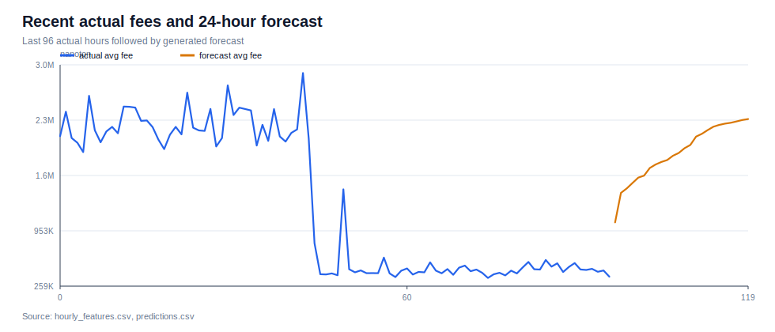

# TON Fee Prediction Visual Summary

Generated by:

```bash
python3 scripts/generate_charts.py
```

## Dataset And Fee Behavior







## Model Performance









## Forecast



## Reading Notes

- `tx_count` and `unique_accounts` are sample counts because collection windows still hit the API page limit.
- `R2` is best read together with MAE/RMSE. The current best model is positive on R2, but still modest.
- The forecast chart starts from the most recent hourly actual fee series and appends the generated 24-hour forecast.
